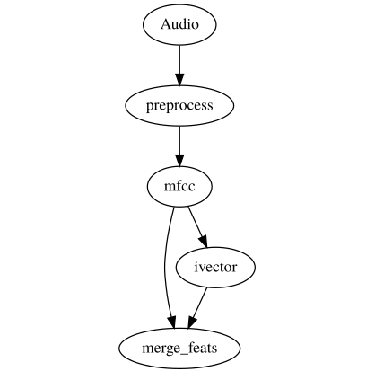

Godec
===================

Godec is a C++-based framework for arbitrarily connecting natural language processing components (or any other data processing code really) into a graph specifiedb by a simple JSON file. This graph can be run as a standalone executable to facilitate easy integration into an offline experiment infrastructure, or taken as-is to be embedded into an end-user application, with no modification necessary. 

Godec exhibits many traits desirable for such a framework:

- It is modular, allowing the clean mixing of vastly different modules into one graph (imagine OpenCV code feeding into a Kaldi recognizer followed by a Tensorflow classifier), **without** having to merge the code bases.
- It is freely extensible, i.e. custom components can quickly be added, as well as custom messaging types for specfic applications.
- Godec is multithreaded. Every component runs in a separate thread, natively allowing for multi-core use.
- **However**, Godec runs in a single process. This allows for immediate internal data passing between component with no overhead.
- Godec processing runs are (subject to contraints) perfectly repeatable from run to run, i.e. they produce identical output results, something not common for massively asynchronous frameworks. It makes sure that an offline experiment result will be faithfully reproduced in the live application (also often not a given).
- Godec is low-latency, i.e. it is perfectly suitable for live stream processing.
- Godec currently is compiled and tested on Linux, Android, Windows and Raspberry Pi.

The Interspeech announcement paper for this open-source project [can be found here.](http://hopefully_accepted)

Also of interest might be [BBN's "Sage" framework that uses Godec](https://www.researchgate.net/publication/307889439_Sage_The_New_BBN_Speech_Processing_Platform), and a paper describing applications [that run on Godec.](https://www.researchgate.net/publication/319292616_Applications_of_the_BBN_Sage_Speech_Processing_Platform)

----

* [Building from source](doc/Building.md)  
* [Using Godec](doc/UsingGodec.md)  
* [Detailed description of the inner workings](doc/Details.md)
* [Developing new components and messages](doc/Development.md)
* [Debugging and profiling](doc/Profiling.md)
* [Godec Java API](java/README.md)
* [Core component list](doc/CoreComponents.md)

