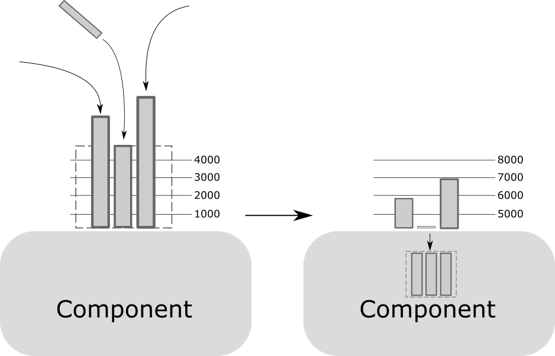

[Back](../README.md)  

# The inner workings of Godec
-----------------

This section describes how exactly Godec shuttles messages around internally, and especially how it facilitates the time-sychronous "slicing" that lies at the core of the engine.

Two papers!

- [Anatomy of a Godec message](#Anatomy-of-a-Godec-message)  
- [Slicing and dicing](#Slicing-and-dicing)  
- [Graph startup and teardown](#Graph-startup-and-teardown)  

## Anatomy of a Godec message

All messages sent inside the graph inherit from the [`DecoderMessage`](../src/include/godec/ChannelMessenger.h) class. This base message does not have a notion of data payload, the data is part of the child class definition ([have a look at the predefined core messages](../src/core_components/GodecMessages.h))

Every message carries a `uint64_t` timestamp that defines its position in the stream:

    uint64_t getTime();

This timestamp carries no predefined meaning, and it is **local** to that stream. That means, what the timestamp represents is up to the first feeding component. For PCM audio it might refer to the total sample count so far, but if more complex features are being pushed it might refer to some other measure that might make sense in that context. If you push text, it might simply be sentence count.

The import thing is, the timestamp must **strictly monotonically increase**. If a component suddenly decides to restart the timestamps for the messages it emits, Godec will exit. Even another message with the same timestamp as the previous one is not allowed, as it would mean redefining the past. Additionally, **all time must be accounted for**. E.g. say a speech recognizer decides the input was all noise and thus has no text as an output. A message (an empty one) still needs to be sent that accounts for the input time span.

One important consequence of the above is, there are no zero-length messages. That is, one can not do the equivalent of "I just realized this utterance is over, here's an update for the same timestamp that the utterance is done". The scenario isn't encountered all too often, but occasionally one has to buffer a small amount of data inside a component so that one can attach the end-of-utterance flag on the last message for that utterance (the `ConversationStateDecoderMessage` in this case). Please note that while the no-zero-length messages constraint seems like an annoying constraint, it is key to what makes Godec work he way it does. 

Another important aspect is, **all messages have to be causal**. This means, no messsage is allowed to make a statement about the future, e.g. "the utterance starts here". Instead, every message is only allowed to make a statement about the time (in terms of timestamp) that has passed since the previous message's timestamp. In concrete example, instead of saying "the utterance starts here", the `ConversationStateDecoderMessage` rather says "it is still the same utterance up to here". Similarly, instead of a component accepting a matrix that is then used from there on, the message should say "use this matrix up to here". This is constraint in practice is usually little more than a philosophical one, it is one again however important to the correct function of Godec.

## Slicing and dicing

Every Godec component inherits from `LoopProcessor` class. Among other things, this base class handles the incoming messages and is responsible for presenting the component-specific`ProcessMessage` function with the newest block of data.

What makes Godec unique is that, even though the messages come from various upstream components at unpredictable times (they all run in their own threads), all this asynchronicity is shielded from the component code and what the`ProcessMessage` function gets presented with is a coherent block of time from **all** incoming message streams. As an example, if a component needs both a feature stream and an audio stream for its processing, `ProcessMessage` never sees just a new chunk of features or a new chunk of audio. Rather, it gets an update from **all** streams, accounting for the time span since the last call. This way of making the highly asynchronous network look synchronous to each component makes it usually very straightforward to make a Godec component from existing (often offline data processing) code. 

Above: A component receives 3 different message streams, and the LoopProcessor class lines them up according to their timestamps (and possibly merges messages of the same stream). It then slices out a contiguous (i.e. fully filled-in) chunk and passes it into the component code. Note how the "overhangs" remain for the first and the last stream, they are the remainders of when Godec cut the initial messages in half.

This sounds all straightforward, but the real trick becomes apparent with the question, how does Godec know how, or even whether, messages can be cut or merged? Consider a `MatrixDecoderMessage` which carries a generic matrix inside. This matrix might for example represent a covariance matrix; there is no meaningful way to split a covariance matrix in half, and a generic framework like Godec can't (and shouldn't) make assumptions about it.

Instead, it is the message itself that knows when and whether it can be sliced at a given time, via the `mergeWith`, `canSliceAt` and `sliceOut` virtual functions that each message class needs to implement:

`bool mergeWith(DecoderMessage_ptr, DecoderMessage_ptr&, bool);`

`bool canSliceAt(uint64_t, std::vector<DecoderMessage_ptr>&, uint64_t, bool);`

`bool sliceOut(uint64_t, DecoderMessage_ptr&, std::vector<DecoderMessage_ptr>&, int64_t, bool);`

([declaration here](../src/core_components/GodecMessages.h))

  

Whenever a new message arrives at a component, the `LoopProcessor` class 

1. Tries to merge this new message with the previous message of the stream (assuming there still is one lined up) by calling `mergeWith` on the message. Depending on the outcome of the function, there is either one bigger message now lined up, or two messages lined up
2. The `LoopProcessor `code identifies possible slicing timestamps (starting with the one that would result in the biggest chunk), and calls `canSliceAt` for the respective message in each stream
3. If **all** streams return `true` for a specific timestamp, the `LoopProcessor` calls `sliceOut` on the respective messages and puts the sliced out messages into a hash map (the key of the map being the stream/slot name, the value the message) and calls `ProcessMessage`. This hash map is the one the component works on then.

The above mechanism is the one that enables the precise operation of Godec (and all the good things coming from it), but it is also hands-down the biggest source of bugs when writing a component or a new message type. The reason being, if a given component doesn't produce correct timestamps, it causes the Godec network to stop (or exit with an erorr) because a downstream component can not find a timestamp that all streams can agree on to be sliced at. A quick illustration, let's assume a component ("MatrixAdder") adds two matrices together, meaning it has two streams that accept `MatrixDecoderMessage` messages. One upstream component ("A") produces a matrix message with the timestamp 1000, but the other ("B") component has maybe an off-by-one calculation error and instead sends a matrix message with timestamp 1001. However, those two messages come together in front of MatrixAdder, but since message A can only be sliced at time 1000 and B only at 1001, there is no way to find a common slicing timestamp.

A quick sidenote here, from the above it may look as if Godec is an inherently unstable framework. In fact, we have found the opposite to be true; Godec is very good at uncovering subtle bugs in one's code that in more lenient frameworks would result in sporadic instability or non-reproducable behavior. So many times what was initially presented as "Godec acting up" turned out to be an unconsidered edge case in one's engine that had so far flown under the radar.

## Graph startup and teardown

The startup mechanism is straightforward, Godec goes through the JSON one by one and instantiates each component. When all components are instantiated, it then calls the `Start` virtual function on each component.

The teardown procedure is more interesting. Godec intentionally has no global governor (those are usually cause for massive problems in frameworks, Python I am looking at you with your GIL) and thus Godec is not aware of where each component is in terms of having processed the data passed onto it. For all intents and purposes, each component is truly "free-standing" and only connected with the rest of the graph via its input and output streams.

The way the teardown is happening is, a component's input channel contains a reference count of how many components are connected to it (the `checkIn` and `checkOut` methods of the [`channel` class](../src/core_components/channel.h)). The feeding component (either a `FileFeeder` component or an API endpoint) is the first, and initially the only, component that knows it is done processing (the `FileFeeder` ran through all its source data, the API endpoint by calling the `BlockingShutdown` method). All it does is to check out of its output connections, thus reducing the reference count of the input channels they were connected to. Those downstream components' input channels now have a reference count of zero, and by that know they will no longer receive any further data. They process their remaining lined up messages, and when they are done, they in turn check out of their downstream connections.

This way, the graph slowly tears itself down, until all components are shut down. Godec internally simply checks repeatedly a simple boolean in each component that gets set to `true` when it is shut down. When all booleans are `true`, the graph is entirely shut down and Godec exits.

BTW, this shutdown mechanism is also the source for the possible `TimeStream not empty` error message when something has gone wrong. When a component no longer receives any new data, by the very end there should be no messages at all remaining, i.e. the `TimeStream` class (which holds the lined up messages) should be empty. If it is not, something has gone wrong (some upstream component didn't account for the entire time span) and the error gets produced.