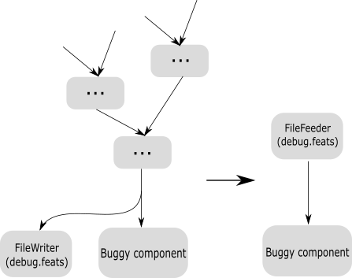

[Back](../README.md)  

Debugging and profiling
===

One outcome of Godec being precise is that it is notoriously inflexible about mistakes and bugs in your code. This section is about how to debug what is going on when something goes wrong.

### Verbose

The first thing to do is to set various components' `verbose` flag to `true` and see at which point things go awry. Is one component simply halting, i.e. no longer processing input? This often points to a timestamp issue in one of the **upstream** components, since the halting component's `LoopProcessor` code can't find a timestamp at which to slice all incoming streams.

### Isolate

When you have an idea about which component is the offender, isolating it from the graph can greatly simplify things, especially when you run it in a debugger. Tee off the buggy component's input into a file, and then only feed that file into the component in isolation in a small JSON. What were maybe 20+ threads to consider are now only two.

### Watch the timestamps

Whether the network halts somewhere, or you get 

`ERROR: We should not slice past the first message:`

incorrect timestamps are likely at fault. Monitor the incoming messages and look at how the message streams stack up next to each other (the `should not slice past` error actually prints that stack) and try to retrace why Godec couldn't find a way to slice a contiguous block of messages out.

`TimeStream structure was not empty at shutdown` is a specific error message that indicates a component had received all its input data, but was not able to entirely process the received messages because they couldn't be sliced out. This can have more than one reason, one being the usual "upstream timestamps are wrong", the other that an upstream component didn't account for all stream time (which is a requirement).

### Profile

This steps is more for performance analysis, to see which components incur the most latency.

To do this you can use the Python script

    tools/AnalyseLatency.py

Do the following steps:

1. Set "verbose" to "true" and "log_file" to a value in the component you want to use as a the reference starting point. Often this is a FileFeeder.
2. Run the Python script with the collected log files as the arguments. The script will display the statistics via matplotlib.

Note that there is a difference between "algorithmic" latency and "realtime" latency. Algorithmic latency is the latency the algorithm of a component incurs, e.g. a component might need 1 second of input audio to create some output. Realtime latency is the combination of the algorithmic latency plus whatever the CPU incurs (thus making it machine-dependent). In order to only measure the algorithmic latency, slow down the input to a very slow pace.

**Gotcha**

Some networks use Router and Merger components (e.g. to separate speech and nonspeech audio). The components between the Merger and the Router have different timestamps than the rest of the network, so if you for example measure between the initial FileFeeder and a Decoder that is inside the Router-Merge combo, the latency will be nonsensical. In this case  the reference point needs to also be inside that Router-Merge span.

